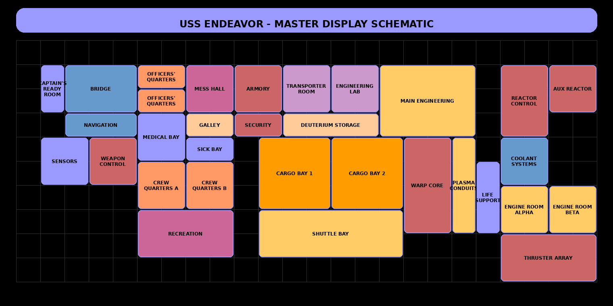
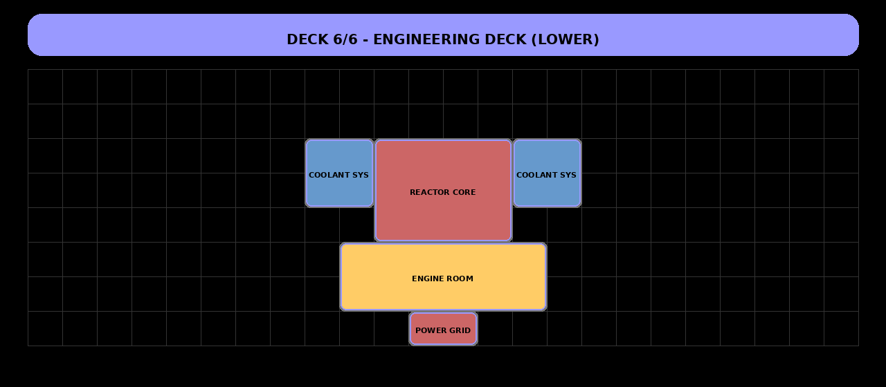
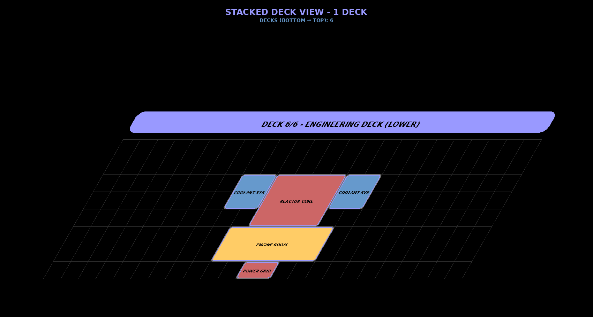

Space Engineers - Master Display System Generator
=================================================

Interactive web-based ship layout designer for Space Engineers! Create beautiful Master Display System (MDS) visualizations with a modern sci-fi aesthetic, perfect for loading into in-game displays.

Use it here: [SE MDS Designer](https://phrasz.github.io/SE_MDS-Generator)

## Two Viewing Modes

The MDS Generator supports two distinct visualization approaches:

### 🔹 Cross-Section View (Bow-to-Stern)
Vertical slices through your ship, showing internal structure from front to back.


*Example: Vertical cross-sections from bow to stern, like cutting the ship front-to-back*

### 🔸 Floor Plan View (Deck-by-Deck)
Horizontal deck layouts viewed from above, like a mall directory showing each floor.


*Example: Horizontal floor plans showing each deck from top to bottom*

**Use Cases:**
- **Cross-Sections**: Perfect for showing ship profile, internal systems, structural integrity
- **Floor Plans**: Ideal for navigation, room locations, deck layouts

📘 **[Read the complete viewing modes guide →](VIEWING_MODES.md)**

### Show Cross-Section View

Visualize your ship's internal structure with a comprehensive bow-to-stern schematic:



*Single comprehensive cross-section showing the entire ship profile from bow to stern*

### Show Multiple Decks

Explore deck-by-deck layouts with animated horizontal slices:



*Deck-by-deck horizontal slices building from bottom (Deck 6) to top (Deck 1)*

Visualize the 3D stacking with perspective:



*3D perspective showing how decks stack from bottom to top*

## Features

- ✨ **Interactive Designer**: Drag & drop rooms with live updates.
- 🏢 **Multi-Deck Support**: Build complex ships with multiple levels.
- 🎨 **Customizable Appearance**: Use preset color palettes or create your own.
- 🖼️ **SVG & PNG Export**: Save designs for use in-game.
- 🛡️ **Auto-Hull Outlines**: Automatically generates a ship hull from your room layout.
- 🔄 **Full Rotation**: Rotate rooms and shapes for unique designs.
- 💾 **Auto-Save**: Progress is saved automatically in your browser.
- 📊 **Dual View Modes**: Create cross-sections OR floor plans

## Creating Your First Ship

1. **Open the app** - Launch index.html in your browser
2. **Add rooms** - Click "+ Add Room" in the sidebar
3. **Position rooms** - Drag rooms from the list onto the canvas grid
4. **Customize** - Double-click rooms to edit colors, sizes, rotation
5. **Export** - Click "Download PNG" or "Download SVG" to save your design

Your work is automatically saved to browser storage!

## Interface Overview

### Ship Configuration Panel

Configure global ship settings:
- **Ship Name** - Displayed in the header banner
- **Color Palette** - Choose from 5 preset themes or create custom
- **Advanced Settings** - Font sizes, offsets, text shadows, grid visibility

### Deck Editor

Create multi-deck ships:
- **Add/Remove Decks** - Build ships with multiple levels
- **Deck Tabs** - Switch between decks for editing
- **Deck Name** - Label each level (e.g., "Upper Decks", "Lower Decks")
- **Grid Dimensions** - Set width/height for each deck (5-30 cells)

### Room Management

Add and customize rooms:
- **Add Room** - Create new room with default settings
- **Drag & Drop** - Position rooms on the canvas grid
- **Double-Click** - Edit room properties
- **Room Properties**:
  - Name and dimensions (width/height)
  - Background and font colors
  - Font size and positioning offsets
  - Rotation (0-360 degrees)

## Working with Rooms

### Adding Rooms

1. Click **"+ Add Room"**
2. Enter room name and dimensions
3. Room appears in the room list
4. Drag the room onto the canvas

### Editing Rooms

**Desktop**: Double-click a room in the list  
**Mobile**: Long-press (500ms) a room in the list

Edit properties:
- Name, width, height
- Background color
- Font color, size, and position offsets
- Rotation angle (updates live!)

### Positioning Rooms

**Mouse**: Click and drag room from list to canvas  
**Touch**: Touch and drag room from list to canvas

Rooms automatically snap to grid cells for precise alignment.

## Working with Outline Shapes

### Adding Shapes

1. Expand **"Manual Outline Mode"**
2. Click **"+ Add Outline Shape"**
3. Choose shape type (Rectangle, Ellipse, Triangle)
4. Set dimensions, color, rotation
5. Drag shape onto canvas

### Shape Features

- **Z-Index**: Controls layering (0=back, 100=front)
- **Auto-Border**: Borders hide when overlapping rooms
- **Rotation**: Triangles point up by default - rotate to change
- **Use Cases**: Hull sections, nacelles, wings, decorative elements

## Export Options

### Export Images

**Download SVG** - Vector format, scalable and editable  
**Download PNG** - Raster format, ready for Space Engineers

Both formats capture the current deck view with all settings applied.

### Export/Import Ship Data

**Export Ship (.json)** - Save entire ship configuration  
**Import Ship (.json)** - Load previously saved ship

Ship files include all decks, rooms, settings, and outline shapes.

### Settings Management

**Export Settings** - Save visual preferences only  
**Import Settings** - Load saved appearance settings

Settings include colors, fonts, outline styles (no ship data).

## Advanced Features

### Custom Color Palettes

1. Select "Custom Palette" from Color Palette dropdown
2. Click **"Edit Custom Palette"**
3. Customize all 9 accent colors plus background, text, border, grid, hull
4. **Export Palette** - Save as JSON file
5. **Import Palette** - Load saved palette

### Color Palettes
- **Classic (Standard Alliance)** - Blue/orange color scheme
- **Crimson (Warrior Clans)** - Red/gold military theme
- **Matrix (The Collective)** - Green/cyan technical theme
- **Imperial (Star Empire)** - Forest green/gold regal theme
- **Golden (Trade Consortium)** - Gold/bronze merchant theme
- **Custom Palette** - Create your own color scheme


### Auto-Save

All changes automatically save to browser localStorage:
- Ship configuration
- Deck layouts
- Room placements
- Custom palettes
- Visual settings

### Danger Zone

**Clear All Rooms** - Remove all rooms from current deck  
**Self Destruct** - Clear all saved data and reset to defaults

⚠️ These actions cannot be undone!

## Generating Demo Animations

Want to create your own animated demonstrations? Use the included Python scripts:

```bash
# Install required library (if not already installed)
pip install Pillow

# Generate both demo GIFs (cross-section + floor plan)
python3 generate_all_demos.py

# Or generate individually:
python3 generate_cross_section_demo.py  # Bow-to-stern cross-sections
python3 generate_floor_plan_demo.py     # Deck-by-deck floor plans
```

Output files are saved to `demo_outputs/`:
- `cross_section_bow_to_stern.gif` - Vertical cross-sections
- `floor_plan_top_to_bottom.gif` - Horizontal deck layouts
- Individual PNG frames for each view

## Tips for Space Engineers

1. **LCD Panel Setup**: Use large LCD panels (5+ panels in a grid recommended)
2. **Multiple Decks**: Display each deck on separate panels
3. **Resolution**: Default 60px cells work well; increase for larger displays
4. **Color Coding**: Use consistent colors for quick room identification
5. **Hull Outline**: Auto-outline shows actual deck shape
6. **Decorative Shapes**: Use outline shapes for nacelles, wings, hull details
7. **Rotation**: Rotate rooms for angled corridors or unique layouts
8. **View Modes**: Use cross-sections for ship profile, floor plans for navigation

## Data Storage

All data stored locally in browser:
- Ship configurations
- Custom palettes  
- Visual settings

**Privacy**: Nothing is sent to any server. All processing happens in your browser.

**Backup**: Export ship JSON files regularly to avoid data loss.

## Troubleshooting

**Rooms not appearing?**
- Check if room is positioned within grid boundaries
- Click "Refresh" button to force re-render
- Ensure grid width/height accommodate room size

**Can't drag rooms?**
- Click room once to select, then drag
- On mobile, ensure you're dragging (not long-pressing to edit)

**Layout looks wrong?**
- Increase grid dimensions if rooms don't fit
- Adjust cell size for better scaling
- Check outline padding if hull border is too thick/thin

**Lost my work?**
- Work is auto-saved to browser localStorage
- Don't use incognito/private mode (storage is temporary)
- Export ship JSON regularly for backups

**PNG export not working?**
- Try SVG export instead (always works)
- Check browser console for errors
- Ensure canvas rendered before exporting